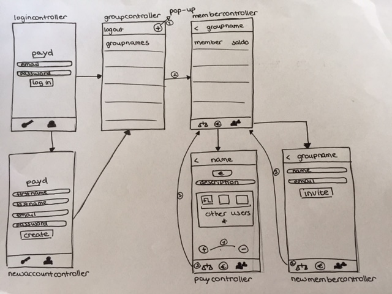
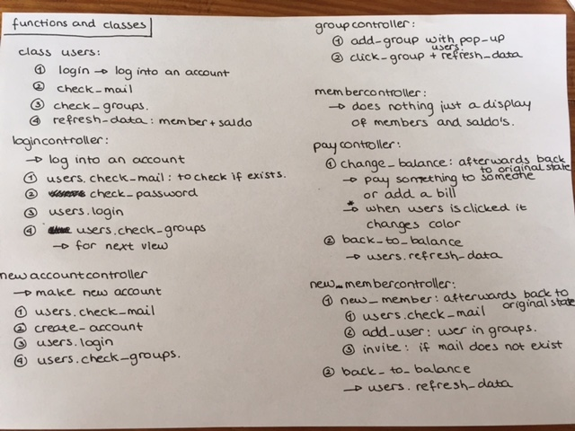
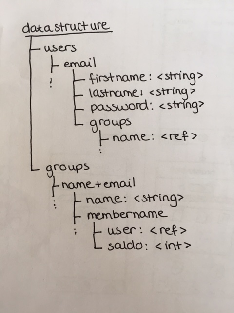

# Design Document
PAYD
## Implementatie van functies and classes
In deze app wordt gebruik gemaakt van 1 extra class. De class voor alle mogelijke functionaliteiten die nodig zijn om gebruikers te checken en aan te melden. Deze class wordt de 'users'-class genoemd. Verder zijn er per viewcontroller nog een aantal functies nodig.

In de bovenstaande foto's is te zien welke functies voor welke controller nodig zijn en wat deze functies doen.

## Databases en frameworks
Voor deze app wordt gebruik gemaakt van de ... van Google. [hier moet nog tussen welke van die plugins gebruikt worden] Om alle benodigde data op te slaan wordt de volgende datastructuur aangehouden.

