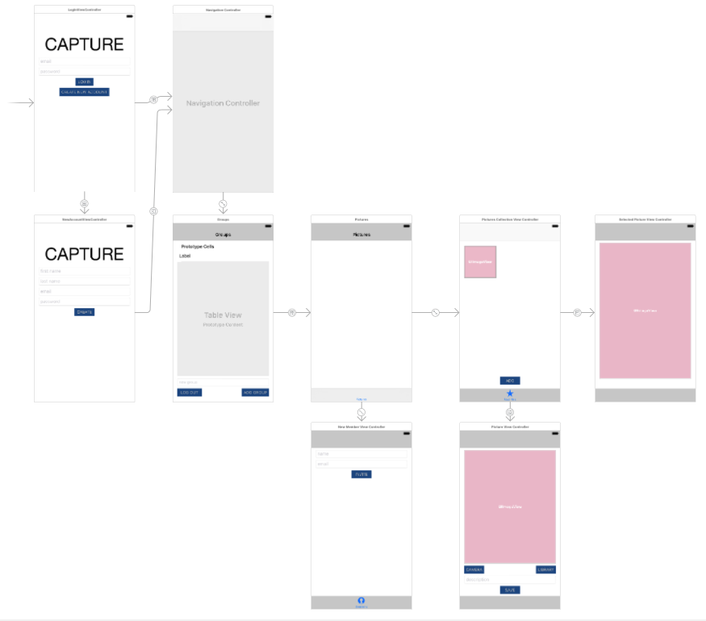

# Programmeerproject
CAPTURE

## Proposal
Met deze app kan je makkelijk fotos delen met vrienden. Je kan via de app fotos maken of via de library fotos kiezen. In deze app kan je eigen account onderhouden en daarnaast makkelijk vrienden uitnodigen via de app. De app maakt gebruik van Firebase Database om alle user informatie op te slaan en gebruikt Firebase Storage voor de fotos. 

### Visualisatie
In de visualisatie hieronder weergegeven is te zien dat een gebruiker de mogelijkheid in te loggen en/of een nieuw account aan te maken. Daarna kan de gebruiker zijn of haar groepen zien. Eenmaal geklikt op een groep is er de mogelijkheid om alle fotos te zien in een collection view. In deze view kan je ook een foto toevoegen en daarnaast als je op een foto klikt wordt deze vergroot afgebeeld.

### Problemen
Ten eerste moet het mogelijk worden dat een gebruiker kan inloggen in groepen kan aanmaken. Daarna moet de gebruiker andere deelnemers kunnen toevoegen. Daarom moeten het mogelijk worden dat via een mail andere gebruikers ook de app kunnen downloaden. Daarnaast moet je ervoor zorgen dat de verschillende gebruikers en groepen worden gekoppeld.

### Review
Voor deze app zijn er verschillende vergelijkbare apps te vinden. Zo is een app die fotos deelt al vrij t zelfde.

### MVP
Voor deze app zijn er verschillende onderdelen onmisbaar. Waaronder de mogelijkheid tot inloggen, account aanmaken, groepen aanmaken, foto maken en deelnemers uitnodigen. Daarnaast zou ook een eventuele chat functie kunnen worden geimplementeerd.

