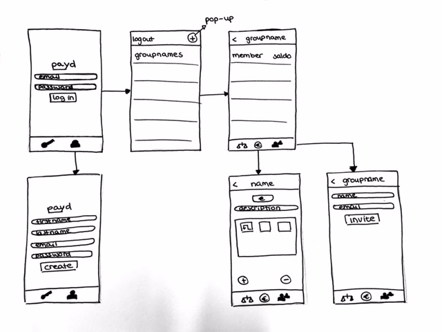

# Programmeerproject
PAYD

## Proposal
Met deze app kan je makkelijk rekeningen delen en hoef je niet zelf je rekenmachine te pakken. Daarnaast kan je niet alleen 1 rekening delen, maar meerdere. Het is ook mogelijk om delen af te betalen. Zodat je precies ziet hoe je er financieel voor staat ten opzichte van je vrienden.
In deze app kan je inloggen met de Google-mail en kan je je vrienden uitnodigen om de app te gebruiken. Op deze manier kan iedereen een rekening toevoegen en/of iemand terugbetalen.
Deze app maakt gebruik van Firebase om alle informatie op te slaan van inloggegevens tot de saldo's van alle deelnemers.

### Visualisatie
In de visualisatie hieronder weergegeven is te zien dat een gebruiker de mogelijkheid in te loggen en/of een nieuw account aan te maken. Daarna kan de gebruiker zijn of haar groepen zien. Eenmaal geklikt op een groep is er de mogelijkheid de balans te zien, een betaling toe te voegen en/of een deelnemer toe te voegen.

### Problemen
Ten eerste moet het mogelijk worden dat een gebruiker kan inloggen in groepen kan aanmaken. Daarna moet de gebruiker andere deelnemers kunnen toevoegen. Daarom moeten het mogelijk worden dat via een mail andere gebruikers ook de app kunnen downloaden. Daarnaast moet je ervoor zorgen dat de verschillende gebruikers en groepen worden gekoppeld.
Een beperking in app is dat er niet de mogelijkheid is om af te betalen met behulp van een eventuele bankieren app.

### Review
Een vergelijkbare app is WieBetaaltWat. In deze app heb je ook de mogelijkheid groepen aan te maken en deelnemers uit te nodigen via mail. Het enige probleem met deze app is dat er alleen een mogelijkheid is tot verrekenen. Wat betekent dat de groep op een gegeven moment afgesloten wordt. In deze app is er in plaats daarvan een mogelijkheid tot afbetalen naar een andere gebruiker. Waardoor de groep kan blijven bestaan.

### MVP
Voor deze app zijn er verschillende onderdelen onmisbaar. Waaronder de mogelijkheid tot inloggen, account aanmaken, groepen aanmaken, betalingen doen en deelnemers uitnodigen. Daarnaast zijn er nog een heleboel extra features die zouden kunnen worden toegevoegd met afbetalen via een bankieren app als de meest voor de hand liggende.
